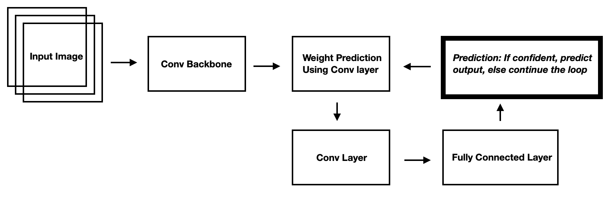

# Dynamic ResNet

## Network Architecture
 

### Architecture is unique featuring dynamic parameters, dynamic depth. But, model doesn't have much functional capacity, it's not even able to overfit single batch of data
